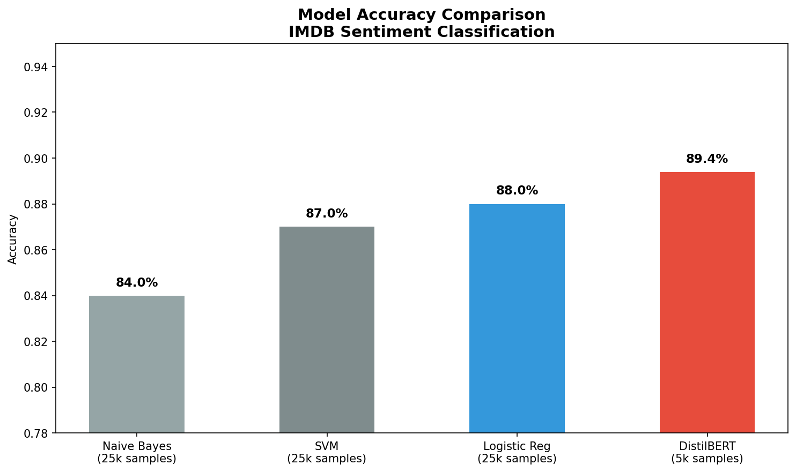
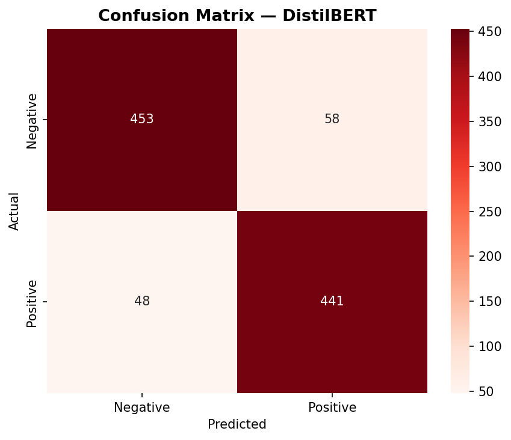
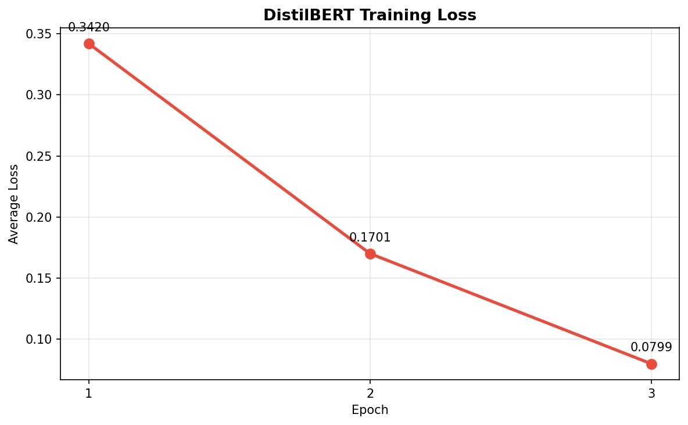

# Sentiment Classifier

NLP sentiment classifier trained on the IMDB dataset (25,000 reviews).
Progresses from classical ML baselines to transformer fine-tuning with DistilBERT.

---

## Results

| Model | Training Data | Accuracy |
|---|---|---|
| Naive Bayes | 25,000 | 84.0% |
| SVM | 25,000 | 87.0% |
| Logistic Regression | 25,000 | 88.0% |
| **DistilBERT** | **5,000** | **89.4%** |

> **Key finding:** DistilBERT achieves higher accuracy with 5x less training data,
> demonstrating the power of transfer learning over classical ML approaches.

---

## Visualizations

### Model Accuracy Comparison


### DistilBERT Confusion Matrix


### DistilBERT Training Loss


---

## What I Built

- **Text preprocessing pipeline** — HTML removal, lowercasing, punctuation stripping, stopword removal
- **Classical ML baselines** — TF-IDF vectorization with Logistic Regression, SVM, and Naive Bayes
- **Error analysis** — Identified key failure patterns: sarcasm, mixed sentiment reviews, and complex analytical language
- **DistilBERT fine-tuning** — Fine-tuned pretrained transformer on IMDB using PyTorch and HuggingFace, trained on GPU in 3 epochs
- **FastAPI deployment** — REST API endpoint returning sentiment + confidence score

---

## Key Insights

1. **Logistic Regression is a strong baseline** — 88% accuracy with simple TF-IDF features
2. **Transfer learning wins with less data** — DistilBERT at 89.4% used only 5,000 training examples vs 25,000 for classical models
3. **Classical models fail on context** — TF-IDF misses sarcasm and mixed reviews; transformers handle these better
4. **Training loss dropped 4x** — From 0.342 → 0.080 across 3 epochs

---

## API Usage

Run locally:
```bash
uvicorn app:app --reload
```

Example request:
```bash
curl -X POST http://127.0.0.1:8000/predict \
  -H "Content-Type: application/json" \
  -d '{"text": "This movie was absolutely fantastic!"}'
```

Example response:
```json
{
  "text": "This movie was absolutely fantastic!",
  "sentiment": "positive",
  "confidence": 94.39,
  "model": "DistilBERT"
}
```

---

## Tech Stack

`Python` `scikit-learn` `HuggingFace Transformers` `PyTorch` `FastAPI` `pandas` `matplotlib` `seaborn` `Google Colab`

---

## Project Structure

```
sentiment-classifier/
├── sentiment_classifier.ipynb   # Full notebook: preprocessing → training → evaluation
├── app.py                       # FastAPI prediction endpoint
├── requirements.txt             # Dependencies
├── model_comparison.png         # Bar chart comparing all 4 models
├── confusion_matrix_bert.png    # DistilBERT confusion matrix
└── training_loss.png            # DistilBERT loss curve across epochs
```

---

## Reproducing the Fine-tuned Model

Model weights are not included due to size. To reproduce, run the notebook end-to-end on Google Colab with a T4 GPU runtime. Training takes ~20 minutes.

---

## Dataset

[Stanford IMDB Dataset](https://huggingface.co/datasets/stanfordnlp/imdb) — 25,000 train / 25,000 test movie reviews, balanced 50/50 positive and negative.
